# Battery XD

  

Battery XD is like the default battery widget, but cute •ᴗ•

The idea of this app was got from [Battery Buddy](https://batterybuddy.app) of [Neil Sardesai](https://twitter.com/neilsardesai/status/1358077388303831041).

| Enough | Normal | Low | Charging |
| :-------: | :-------: | :----: | :---------: |
| 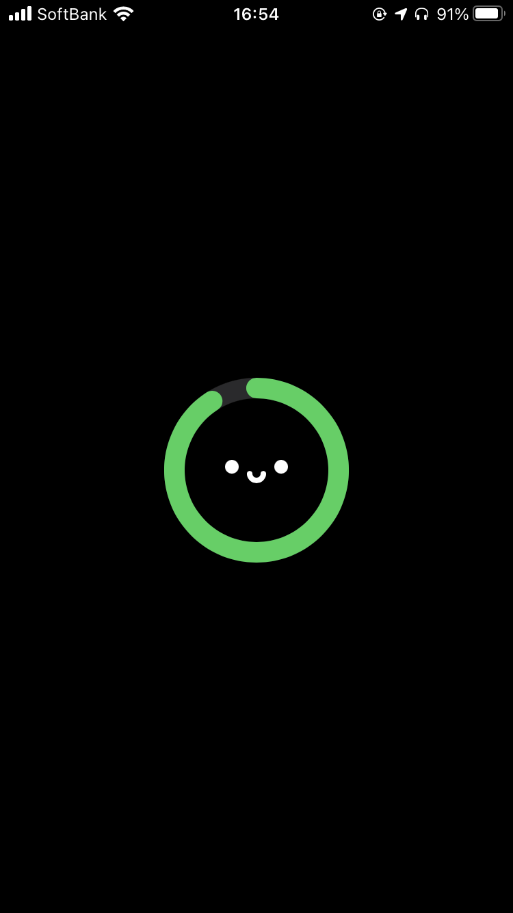 | 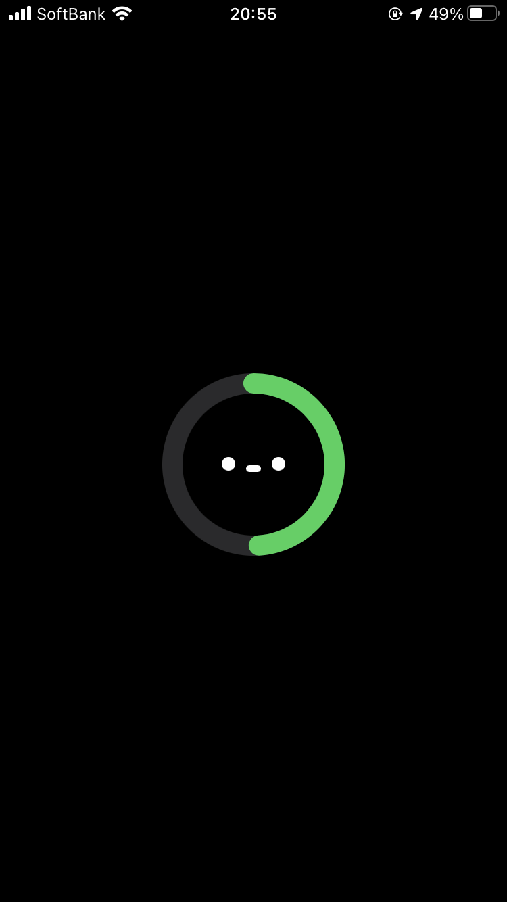 | 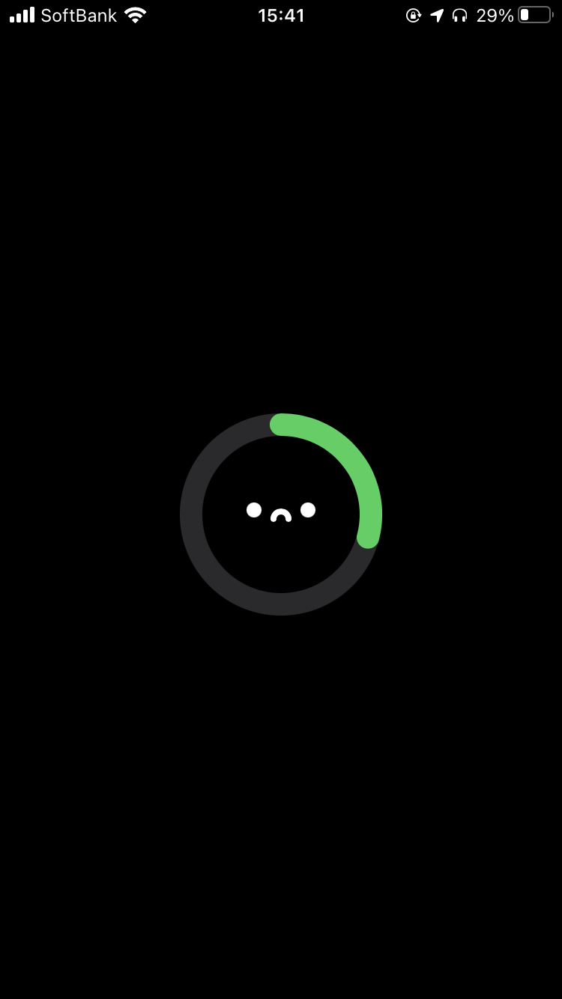 | 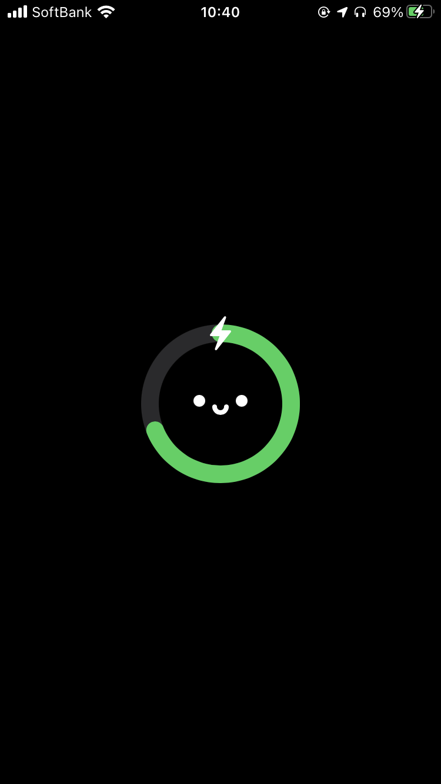 |

## Widget
Widgets refresh is not real-time. It will be updated approximately every 15 minutes. It will also be updated by launching the app.

  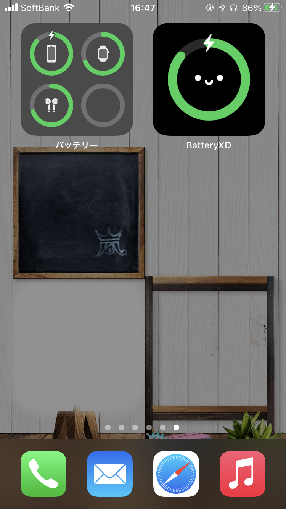

## watchOS

  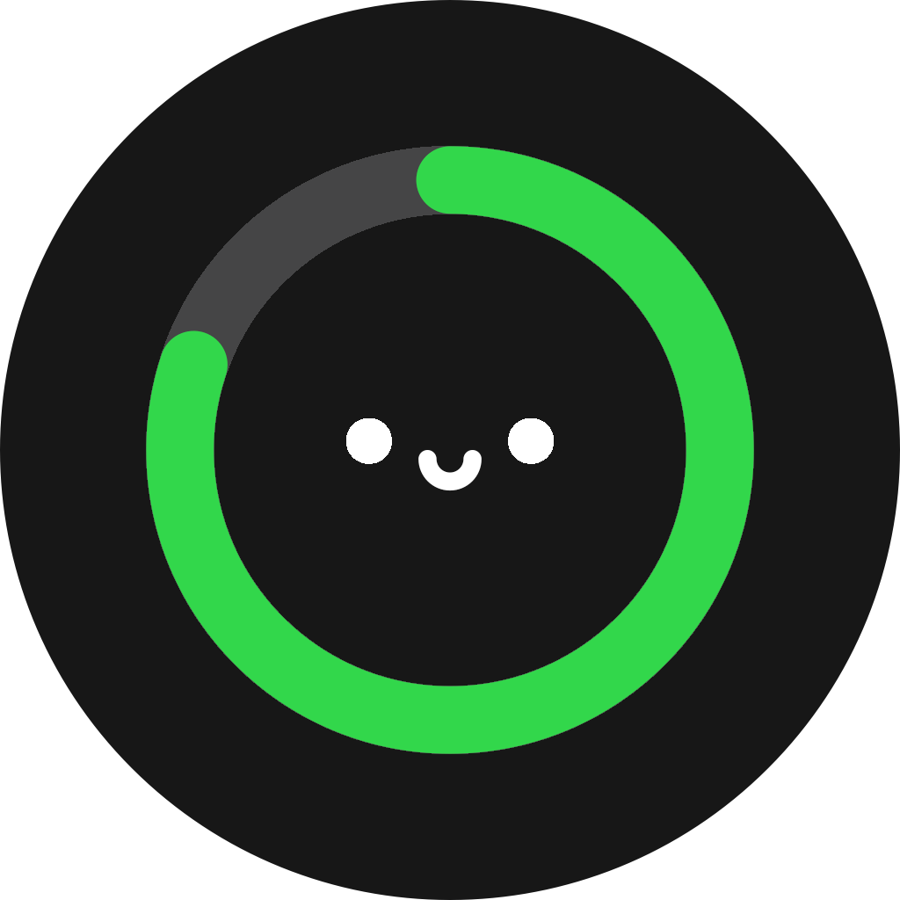

| Enough | Normal | Low | Charging |
| :-------: | :-------: | :----: | :---------: |
| 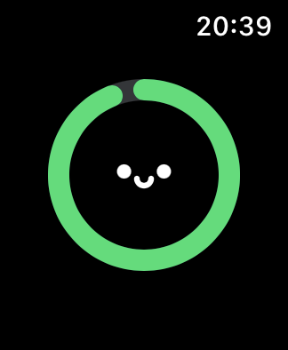 | 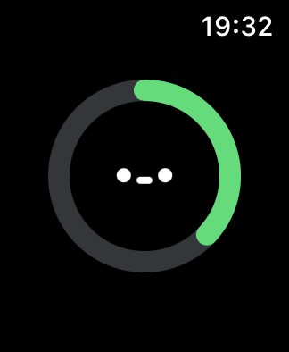 | 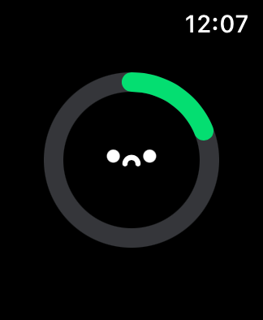 | 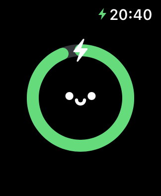 |

### Complications (Not working)

| 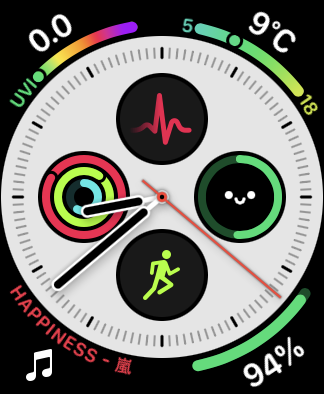 | 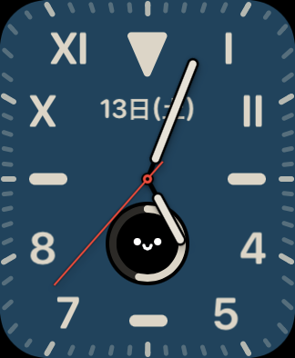 | 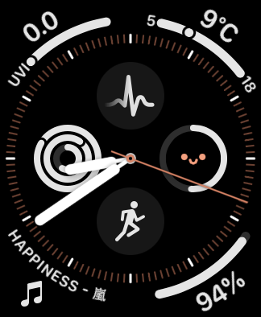 |
| :-----: | :-----: | :-----: |

## Requirements
- iOS 14.0+
- watchOS 7.0+
- macOS 11.0+
- Xcode 12.0+
